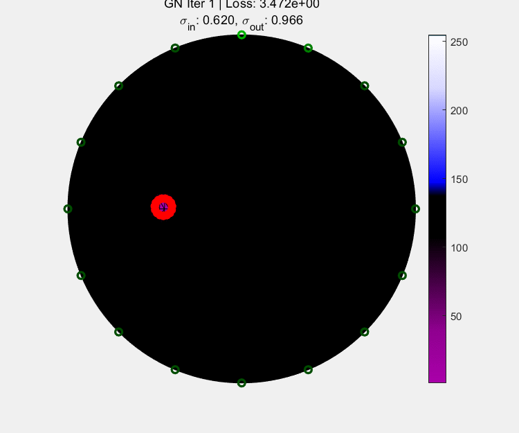

# GSC_EIT
**This code is provided for research purpose only.**

Run "GSC_GN_Demo.m and GSC_LM_Demo" for examples. (Using the EIDORS Toolbox)

<table>
  <tr>
    <td></td>
    <td></tGNd>
  </tr>
</table>

*These two demos have been optimized based on the paper, so there may be differences in the details. Multi-object reconstruction can add curves on this basis. Initial position estimation methods are not included in the code. Please implement this yourself.*

**Please cite our paper if this code is used to motivate any publications.**

**https://doi.org/10.1016/j.flowmeasinst.2025.102973**

**Z. Chen, L. Shi, X. Qiao, B. Li and S. Liang, "Geometric Shape Characterization-based Algorithm for Electrical Impedance Tomography Reconstruction," in Flow Measurement and Instrumentation, 2025.**
